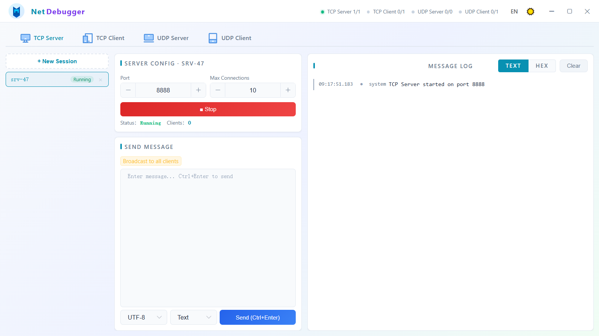
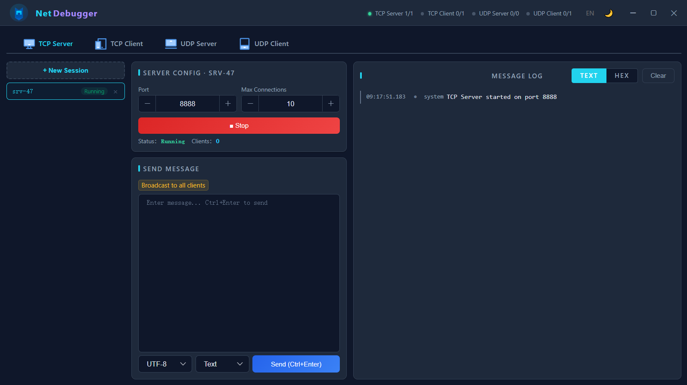

# NetDebugger

[](https://opensource.org/licenses/MIT)

A beautifully crafted, cross-platform TCP/UDP/SSH debugging tool with an elegantly designed web-based UI powered by Chromium Embedded Framework.

> [中文文档](./README_zh.md)

---

## Interface




---

## Features

- **TCP Server** — listen on a port, accept multiple clients, send/receive messages, support broadcast and targeted sending
- **TCP Client** — connect to remote TCP servers, send/receive messages
- **UDP Server** — bind a local port, receive datagrams, track known clients, send to specific clients or broadcast
- **UDP Client** — bind local port, send datagrams to target hosts
- **SSH Client** — connect via SSH with full terminal emulation (xterm-256color), PTY resize, and SFTP file management (browse, upload, download with progress, delete, rename)
- **Multi-session** — create and manage multiple server/client instances simultaneously
- **Dark/Light theme** — supports light mode, dark mode, and auto (follow system)
- **Chinese / English i18n** — full bilingual UI with dynamic language switching
- **Session persistence** — automatically saves and restores session configurations across restarts
- **Log display** — color-coded sent/received/system messages, click to copy content
- **HEX support** — send and receive data in either text (UTF-8/GBK/ASCII) or hexadecimal format
> Support sending hexadecimal data in the following formats：<br>
> 01 02 03 <br>
> 010203 <br>
> 0x01 0x02 0x03 <br>
> 0x010x020x03 <br>
> \x01 \x02 \x03 <br>
> \x01\x02\x03 <br>
---

## Tech Stack

| Layer | Technology |
|---|---|
| Shell | Java AWT/Swing (undecorated window) |
| Browser Engine | JCEF (Java Chromium Embedded Framework) |
| Frontend | Vue 2.7 + Element UI |
| Build | Maven + maven-shade-plugin (fat jar) |
| Packaging | jpackage (app-image) |
| Networking | Java NIO (java.net standard API) |
| SSH Connectivity | JSch |
| Terminal Emulation | xterm.js |

---

## Prerequisites

- **JDK 17+** (development & building)
- **Maven 3.6+** (building fat jar)
- **Windows** (current runtime supports `windows-amd64`; other platforms require corresponding JCEF runtime binaries)

---

## Quick Start

### 1. Run in Development Mode

```bash
# Build the fat jar
mvn clean package

# Run
java -jar target/tcp-udp-debug-tool-1.0.0.jar
```

> The program internally implements automatic JCEF environment discovery (`App.findRuntimesDir` method), so no additional environment specification is needed at runtime: `-Djava.library.path="./runtimes/windows-amd64"`

On Windows, you can also simply double-click `run.bat` after building.
> You need to configure your JDK17 path in `run.bat`.

---

### 2. Package as Distributable App

Use `jpackage` to create a self-contained app-image — end users do **not** need a JDK to run it.

#### Run the Package Script

Edit the `JDK_HOME` path in `package.sh` to point to your JDK 17+ installation, then:

```bash
bash package.sh
```

The output will be in `installer-output/NetDebugger/`. Users can launch `NetDebugger.exe` directly from that directory — no JDK required.

> On Windows, please install Git Bash to support shell script execution. After installation, run the `package.sh` script in Git Bash.

#### Customizing the Package Script

```bash
# package.sh key parameters:
--type app-image          # Creates a self-contained directory (no installer)
--name "NetDebugger"      # Application name
--app-version "1.0.0"     # Version number
--vendor "DebugTool"      # Vendor/publisher name
--java-options "-Xms128m" # Minimum heap
--java-options "-Xmx512m" # Maximum heap
```

To create an installer (`.msi`/`.exe` on Windows, `.dmg` on macOS, `.deb`/`.rpm` on Linux), change `--type app-image` to `--type msi` or `--type exe` (requires WiX Toolset on Windows).

---

## Frontend Development

The frontend resides in the [`frontend/`](./frontend) directory — a standalone Vue 2.7 + Element UI project built with Vite.

### Tech Stack

| Technology | Version | Purpose |
|---|---|---|
| Vue | 2.7.16 | Reactive UI framework (Options API) |
| Element UI | 2.15.14 | Desktop UI component library |
| Vite | 5.x | Dev server & build tool |
| vite-plugin-vue2 | 2.0.3 | Vue 2 SFC compilation plugin |
| xterm.js | 5.3.0 | SSH terminal emulation |
| xterm-addon-fit | 0.8.0 | Auto-fit terminal to container |

### Directory Structure

```
frontend/
├── index.html                 # HTML entry point
├── package.json               # Dependencies & scripts
├── vite.config.js             # Vite build config
├── public/                    # Static assets (copied as-is on build)
│   └── img/                   # Icons, logos, etc.
└── src/
    ├── main.js                # Vue app entry, imports Element UI & xterm.css
    ├── App.vue                # Root component: layout, session mgmt, event dispatch, theme/i18n
    ├── bridge.js              # JS ↔ Java bridge ready flag
    ├── i18n.js                # i18n message dictionary (Chinese & English)
    ├── utils.js               # Utilities (callJava, makeSession, hexDecode, etc.)
    └── components/
        ├── TcpServerPanel.vue # TCP Server panel component
        ├── TcpClientPanel.vue # TCP Client panel component
        ├── UdpServerPanel.vue # UDP Server panel component
        ├── UdpClientPanel.vue # UDP Client panel component
        └── SshClientPanel.vue # SSH Client panel component (terminal + SFTP)
```

### Build Output

Build artifacts are emitted to `src/main/resources/web/`, which is served directly by the embedded HTTP server in `App.java`.

```bash
# Enter the frontend directory
cd frontend

# Install dependencies (first time only)
npm install

# Start dev server with hot reload
npm run dev

# Production build
npm run build
```

> Note: `mvn package` does **not** automatically trigger a frontend build. You should run `npm run build` manually inside `frontend/`. If desired, integrate `frontend-maven-plugin` into `pom.xml` for automated builds.

### Architecture

#### Java ↔ JavaScript Bridge

The frontend communicates with the Java backend via `window.cefQuery` (JCEF's JavaScript binding):

- **Frontend → Java**: `callJava(method, ...args)` → serialized to JSON → sent via `cefQuery` → received by `JSBridgeHandler.java` → routed to the appropriate Service
- **Java → Frontend**: Java calls `CefBrowser.executeJavaScript` to invoke `window.handleBridgeEvent(json)` → handled by `App.vue`'s `handleEvent` method

See the `handleEvent` method in `App.vue` for the complete event list.

#### Session Management

- Each session type (TCP Server, TCP Client, UDP Server, UDP Client, SSH Client) maintains its own session array (e.g., `tcpSessions`, `sshSessions`) and active ID (e.g., `tcpActiveId`, `sshActiveId`)
- `makeSession(prefix, extras)` creates session objects uniformly with auto-incrementing IDs
- Session config is persisted via `callJava('persistSessions', JSON.stringify(all))` to the Java backend

#### Theme System

- Supports three modes: `light`, `dark`, `auto` (follows system preference)
- Theme switching via CSS custom properties (`--bg-primary`, `--text-primary`, etc.)
- `auto` mode uses `@media (prefers-color-scheme: dark)` media query
- Theme choice is stored in `localStorage` and synced to the Java backend

#### Internationalization

- Bilingual support (Chinese & English) via the `i18nMessages` dictionary in `i18n.js`
- `$t(key)` method for in-template translations; `setLang(cmd)` switches language
- Language preference is persisted to `localStorage` and synced to the Java backend

---

## Project Structure

```
NetDebugger/
├── frontend/                                   # Vue 2.7 + Element UI frontend source
│   ├── src/
│   │   ├── App.vue                             # Root component
│   │   ├── components/                         # 5 protocol panel components
│   │   ├── utils.js                            # Utility functions
│   │   ├── i18n.js                             # i18n message dictionary
│   │   └── bridge.js                           # JS bridge ready flag
│   ├── vite.config.js                          # Vite build config
│   └── package.json                            # Frontend dependencies
├── src/
│   └── main/
│       ├── java/com/debugtool/
│       │   ├── App.java                        # Entry point (AWT window + JCEF + HTTP server)
│       │   ├── handler/
│       │   │   ├── JSBridgeHandler.java        # JS ↔ Java generic bridge entry
│       │   │   ├── BridgeUtils.java            # Bridge helper utilities
│       │   │   ├── TcpBridgeHandler.java       # TCP-specific bridge handling
│       │   │   ├── UdpBridgeHandler.java       # UDP-specific bridge handling
│       │   │   └── SshBridgeHandler.java       # SSH-specific bridge handling
│       │   ├── model/
│       │   │   └── LogEntry.java               # Log data model
│       │   ├── service/
│       │   │   ├── TcpServerService.java       # TCP server logic
│       │   │   ├── TcpClientService.java       # TCP client logic
│       │   │   ├── UdpServerService.java       # UDP server logic
│       │   │   ├── UdpClientService.java       # UDP client logic
│       │   │   ├── SshClientService.java       # SSH client logic (terminal + SFTP)
│       │   │   └── PersistenceService.java     # Session persistence I/O
│       │   └── util/
│       │       ├── HexUtil.java                # HEX encode/decode utility
│       │       └── I18n.java                   # Internationalization utility
│       └── resources/
│           ├── web/                            # Frontend build output (generated from frontend/)
│           ├── i18n/                           # Java-side i18n resource files
│           │   ├── messages.properties
│           │   └── messages_zh_CN.properties
│           └── logo/                           # Logo resources
│               ├── icon.ico                    # Windows app icon
│               └── icon.png                    # Window icon
├── interface/                                  # README screenshots
├── runtimes/                                   # JCEF runtime binaries
├── installer-output/                           # jpackage output directory
├── pom.xml                                     # Maven build config
├── package.sh                                  # jpackage build script
├── run.bat                                     # Windows dev-mode launcher
├── dependency-reduced-pom.xml                  # Maven shade plugin reduced POM
├── setJava.txt                                 # JDK path config hint
├── .gitignore
├── .gitattributes
├── LICENSE                                     # MIT License
└── THIRD-PARTY                                 # Third-party license notices
```

---

## Third-Party Dependencies

See [THIRD-PARTY](./THIRD-PARTY) for full license details.

| Dependency | License | Purpose |
|---|---|---|
| JCEF / CEF | BSD | Embedded Chromium browser engine |
| Vue.js 2.7 | MIT | Frontend reactive framework |
| Element UI | MIT | UI component library |
| Gson 2.10 | Apache 2.0 | JSON serialization |
| JSch | BSD | SSH connectivity |
| xterm.js | MIT | Terminal emulation |

---

## License

This project is licensed under the MIT License — see [LICENSE](./LICENSE) for details.
