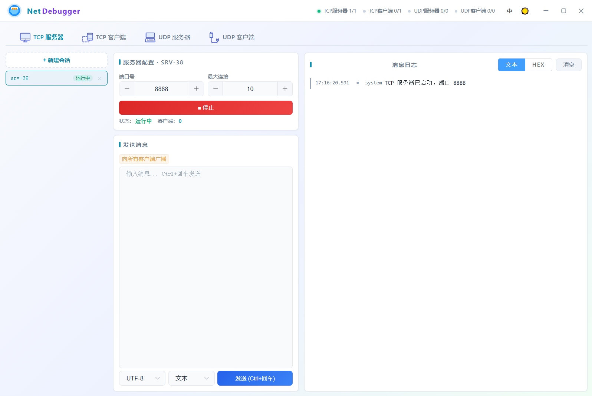

# NetDebugger

[](https://opensource.org/licenses/MIT)

一款基于 Chromium Embedded Framework 的跨平台 TCP/UDP 网络调试工具，内嵌 Vue 前端，提供原生桌面体验。

> [English Documentation](./README.md)

---

## 界面



---

## 功能特性

- **TCP 服务器** — 监听端口，支持多客户端连接，收发消息，支持广播和定向发送
- **TCP 客户端** — 连接远程 TCP 服务器，收发消息
- **UDP 服务器** — 绑定本地端口，接收数据报，追踪已知客户端，定向或广播发送
- **UDP 客户端** — 绑定本地端口，向目标主机发送数据报
- **多会话管理** — 同时创建和管理多个服务器/客户端实例
- **十六进制支持** — 支持文本（UTF-8/GBK/ASCII）和 HEX 两种收发格式
- **深色/浅色主题** — 支持浅色、深色、跟随系统三种模式
- **中英文国际化** — 完整双语界面，动态切换
- **会话持久化** — 自动保存和恢复会话配置
- **日志展示** — 发送/接收/系统消息颜色区分，点击复制内容

---

## 技术栈

| 层 | 技术 |
|---|---|
| 外壳 | Java AWT/Swing（无边框窗口） |
| 浏览器引擎 | JCEF (Java Chromium Embedded Framework) |
| 前端 | Vue 2.7 + Element UI |
| 构建 | Maven + maven-shade-plugin（fat jar） |
| 打包 | jpackage（app-image） |
| 网络通信 | Java NIO（java.net 标准 API） |

---

## 环境要求

- **JDK 17+**（开发和构建）
- **Maven 3.6+**（构建 fat jar）
- **Windows**（当前运行时支持 `windows-amd64`；其他平台需相应的 JCEF 运行时二进制文件）

---

## 快速开始

### 1. 开发模式运行

```bash
# 构建 fat jar
mvn clean package

# 直接运行（需要项目根目录下有 runtimes/ 目录）
java -Djava.library.path="./runtimes/windows-amd64" -jar target/tcp-udp-debug-tool-1.0.0.jar
```

Windows 下也可直接双击 `run.bat` 启动。

> **注意：** 包含 JCEF 原生库的 `runtimes/` 目录会在首次构建时由 `jcefmaven` 自动下载。如果下载失败，请检查网络是否能够访问 `jcefmaven.friwi.me`。

---

### 2. 打包为可分发应用

使用 `jpackage` 创建自包含的应用镜像（app-image），终端用户无需安装 JDK。

#### 第一步：构建 fat jar

```bash
mvn clean package
```

#### 第二步：准备 `package-input/` 目录

在项目根目录下创建 `package-input/`，结构如下：

```
package-input/
├── tcp-udp-debug-tool-1.0.0.jar    # 构建产物（fat jar）
└── runtimes/                         # JCEF 原生二进制文件
    └── windows-amd64/                # Chromium DLL 等
        ├── chrome_elf.dll
        ├── libcef.dll
        ├── jcef.dll
        └── ...（其他原生库）
```

> `runtimes/` 目录在执行 `mvn package` 后会自动生成在项目根目录，将其复制（或软链接）到 `package-input/` 中即可。

#### 第三步：运行打包脚本

修改 `package.sh` 中的 `JDK_HOME` 路径，指向你的 JDK 17+ 安装目录，然后执行：

```bash
bash package.sh
```

输出将位于 `installer-output/NetDebugger/`。用户可直接在该目录中启动 `NetDebugger.exe`，无需安装 JDK。

#### 自定义打包参数

```bash
# package.sh 关键参数说明：
--type app-image          # 创建自包含目录（非安装包）
--name "NetDebugger"      # 应用名称
--app-version "1.0.0"     # 版本号
--vendor "DebugTool"      # 发行者名称
--java-options "-Xms128m" # 最小堆内存
--java-options "-Xmx512m" # 最大堆内存
```

如需生成安装包（Windows `.msi`/`.exe`、macOS `.dmg`、Linux `.deb`/`.rpm`），将 `--type app-image` 改为 `--type msi` 或 `--type exe`（Windows 下需要安装 WiX Toolset）。

---

## 项目结构

```
JavaFxCEF/
├── src/
│   └── main/
│       ├── java/com/debugtool/
│       │   ├── App.java                   # 主入口（AWT 窗口 + JCEF + HTTP 服务器）
│       │   ├── JSBridgeHandler.java       # JS ↔ Java 桥接层
│       │   ├── model/
│       │   │   └── LogEntry.java          # 日志数据模型
│       │   └── service/
│       │       ├── TcpServerService.java  # TCP 服务器逻辑
│       │       ├── TcpClientService.java  # TCP 客户端逻辑
│       │       ├── UdpServerService.java  # UDP 服务器逻辑
│       │       ├── UdpClientService.java  # UDP 客户端逻辑
│       │       ├── HexUtil.java           # 十六进制编解码工具
│       │       ├── I18n.java              # 国际化工具
│       │       └── PersistenceService.java# 会话持久化 I/O
│       └── resources/
│           ├── web/                       # Vue + Element UI 前端
│           │   ├── index.html
│           │   └── img/
│           ├── i18n/                      # 语言资源文件
│           │   ├── messages.properties
│           │   └── messages_zh_CN.properties
│           ├── icon.png                   # 窗口图标
│           └── icon.ico                   # Windows 应用图标
├── pom.xml                                # Maven 构建配置
├── package.sh                             # jpackage 打包脚本
├── run.bat                                # Windows 开发模式启动脚本
├── LICENSE                                # MIT 许可证
└── THIRD-PARTY                            # 第三方依赖许可证
```

---

## 第三方依赖

完整许可证信息见 [THIRD-PARTY](./THIRD-PARTY)。

| 依赖 | 许可证 | 用途 |
|---|---|---|
| JCEF / CEF | BSD | 内嵌 Chromium 浏览器引擎 |
| Vue.js 2.7 | MIT | 前端响应式框架 |
| Element UI | MIT | UI 组件库 |
| Gson 2.10 | Apache 2.0 | JSON 序列化 |

---

## 许可证

本项目使用 MIT 许可证，详见 [LICENSE](./LICENSE)。
