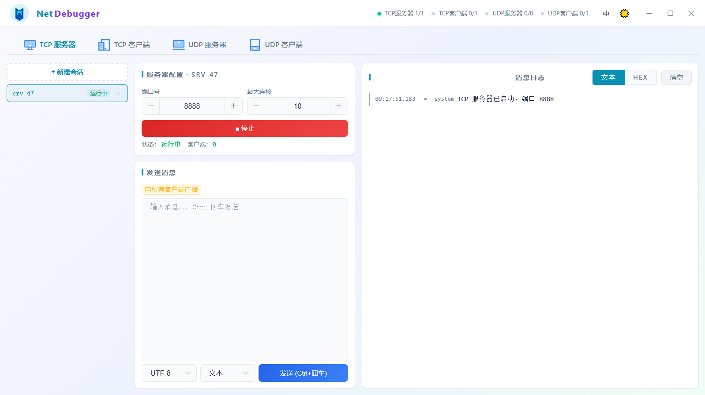
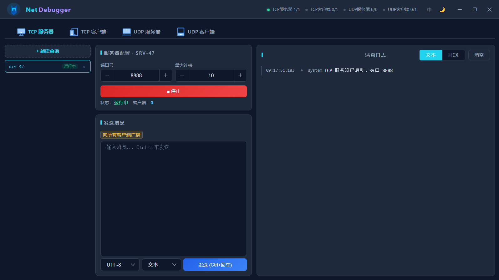

# NetDebugger

[](https://opensource.org/licenses/MIT)

一款基于 Chromium Embedded Framework 的跨平台 TCP/UDP/SSH 网络调试工具，内嵌 Vue 前端，界面精致美观，提供原生桌面体验。

> [English Documentation](./README.md)

---

## 界面




---

## 功能特性

- **TCP 服务器** — 监听端口，支持多客户端连接，收发消息，支持广播和定向发送
- **TCP 客户端** — 连接远程 TCP 服务器，收发消息
- **UDP 服务器** — 绑定本地端口，接收数据报，追踪已知客户端，定向或广播发送
- **UDP 客户端** — 绑定本地端口，向目标主机发送数据报
- **SSH 客户端** — 通过 SSH 连接远程服务器，支持完整终端模拟（xterm-256color）、PTY 尺寸调整，以及 SFTP 文件管理（浏览、上传、带进度的下载、删除、重命名）
- **多会话管理** — 同时创建和管理多个服务器/客户端实例
- **深色/浅色主题** — 支持浅色、深色、跟随系统三种模式
- **中英文国际化** — 完整双语界面，动态切换
- **会话持久化** — 自动保存和恢复会话配置
- **日志展示** — 发送/接收/系统消息颜色区分，点击复制内容
- **十六进制支持** — 支持文本（UTF-8/GBK/ASCII）和 HEX 两种收发格式
> 支持以下形式发送十六进制数据：<br>
> 01 02 03 <br>
> 010203 <br>
> 0x01 0x02 0x03 <br>
> 0x010x020x03 <br>
> \x01 \x02 \x03 <br>
> \x01\x02\x03 <br>

---

## 技术栈

| 层 | 技术 |
|---|---|
| 外壳 | Java AWT/Swing（无边框窗口） |
| 浏览器引擎 | JCEF (Java Chromium Embedded Framework) |
| 前端 | Vue 2.7 + Element UI |
| 构建 | Maven + maven-shade-plugin（fat jar） |
| 打包 | jpackage（app-image） |
| 网络通信 | Java NIO（java.net 标准 API） |
| SSH 连接 | JSch |
| 终端模拟 | xterm.js |

---

## 环境要求

- **JDK 17+**（开发和构建）
- **Maven 3.6+**（构建 fat jar）
- **Windows**（当前运行时支持 `windows-amd64`；其他平台需相应的 JCEF 运行时二进制文件）

---

## 快速开始

### 1. 开发模式运行

```bash
# 构建 fat jar
mvn clean package

# 运行
java -jar target/tcp-udp-debug-tool-1.0.0.jar
```

> 程序内部已实现自动寻找JCEF环境（App.findRuntimesDir方法），在运行时不需要额外指定环境：`-Djava.library.path="./runtimes/windows-amd64"`


Windows 下构建后也可直接双击 `run.bat` 启动。
> 需要在run.bat配置你的jdk17路径。


---

### 2. 打包为可分发应用

使用 `jpackage` 创建自包含的应用镜像（app-image），终端用户无需安装 JDK。


#### 运行打包脚本

修改 `package.sh` 中的 `JDK_HOME` 路径，指向你的 JDK 17+ 安装目录，然后执行：

```bash
bash package.sh
```

输出将位于 `installer-output/NetDebugger/`。用户可直接在该目录中启动 `NetDebugger.exe`，无需安装 JDK。

> windows下请安装git bash以支持sh脚本执行，安装后使用git bash中运行package.sh脚本。

#### 自定义打包参数

```bash
# package.sh 关键参数说明：
--type app-image          # 创建自包含目录（非安装包）
--name "NetDebugger"      # 应用名称
--app-version "1.0.0"     # 版本号
--vendor "DebugTool"      # 发行者名称
--java-options "-Xms128m" # 最小堆内存
--java-options "-Xmx512m" # 最大堆内存
```

如需生成安装包（Windows `.msi`/`.exe`、macOS `.dmg`、Linux `.deb`/`.rpm`），将 `--type app-image` 改为 `--type msi` 或 `--type exe`（Windows 下需要安装 WiX Toolset）。

---

## 前端开发

前端位于 [`frontend/`](./frontend) 目录，是一个独立的 Vue 2.7 + Element UI 项目，使用 Vite 构建。

### 技术选型

| 技术 | 版本 | 用途 |
|---|---|---|
| Vue | 2.7.16 | 响应式 UI 框架（Options API） |
| Element UI | 2.15.14 | 桌面端 UI 组件库 |
| Vite | 5.x | 开发服务器与构建工具 |
| vite-plugin-vue2 | 2.0.3 | Vue 2 SFC 编译支持 |
| xterm.js | 5.3.0 | SSH 终端模拟 |
| xterm-addon-fit | 0.8.0 | 终端自动适配容器尺寸 |

### 目录结构

```
frontend/
├── index.html                 # HTML 入口
├── package.json               # 依赖与脚本
├── vite.config.js             # Vite 构建配置
├── public/                    # 静态资源（编译时原样复制）
│   └── img/                   # 图标、logo 等图片资源
└── src/
    ├── main.js                # Vue 应用入口，挂载 Element UI 和 xterm.css
    ├── App.vue                # 根组件：布局、会话管理、事件分发、主题/语言切换
    ├── bridge.js              # JS ↔ Java 桥接就绪标志
    ├── i18n.js                # 中英文国际化消息字典
    ├── utils.js               # 工具函数（callJava、makeSession、hexDecode 等）
    └── components/
        ├── TcpServerPanel.vue # TCP 服务器面板组件
        ├── TcpClientPanel.vue # TCP 客户端面板组件
        ├── UdpServerPanel.vue # UDP 服务器面板组件
        ├── UdpClientPanel.vue # UDP 客户端面板组件
        └── SshClientPanel.vue # SSH 客户端面板组件（终端 + SFTP）
```

### 构建输出

构建产物输出到 `src/main/resources/web/`，由 Java 内嵌 HTTP 服务器（`App.java`）直接托管。

```bash
# 进入前端目录
cd frontend

# 安装依赖（首次）
npm install

# 启动开发服务器（热更新）
npm run dev

# 生产构建
npm run build
```

> 一般情况下，执行 `mvn package` 时 Maven 不会自动触发前端构建。前端构建需在 `frontend/` 目录下手动执行 `npm run build`。也可以自行在 `pom.xml` 中集成 `frontend-maven-plugin` 实现自动化构建。

### 架构说明

#### Java ↔ JavaScript 桥接

前端通过 `window.cefQuery`（JCEF 提供的 JavaScript 绑定）与 Java 后端通信：

- **前端调用 Java**：`callJava(method, ...args)` → 序列化为 JSON → `cefQuery` 发送 → `JSBridgeHandler.java` 接收并路由到对应 Service
- **Java 推送事件**：Java 端通过 `CefBrowser.executeJavaScript` 调用 `window.handleBridgeEvent(json)` → `App.vue` 的 `handleEvent` 方法处理

完整事件列表见 `App.vue` 中的 `handleEvent` 方法。

#### 会话管理

- 每个会话类型（TCP 服务器、TCP 客户端、UDP 服务器、UDP 客户端、SSH 客户端）维护独立的会话数组（`tcpSessions`、`sshSessions` 等）和活跃 ID（`tcpActiveId`、`sshActiveId` 等）
- `makeSession(prefix, extras)` 统一创建会话对象，自动生成自增 ID
- 会话配置通过 `callJava('persistSessions', JSON.stringify(all))` 持久化到 Java 后端

#### 主题系统

- 支持 `light`、`dark`、`auto`（跟随系统）三种模式
- 通过 CSS 变量（`--bg-primary`、`--text-primary` 等）实现主题切换
- `auto` 模式使用 `@media (prefers-color-scheme: dark)` 媒体查询
- 主题选择存储在 `localStorage` 并同步到 Java 后端

#### 国际化

- 中英文双语支持，通过 `i18n.js` 中的 `i18nMessages` 字典实现
- `$t(key)` 方法提供模板内翻译；`setLang(cmd)` 切换语言
- 语言设置持久化到 `localStorage` 并同步到 Java 后端

---

## 项目结构

```
JavaFxCEF/
├── src/
│   └── main/
│       ├── java/com/debugtool/
│       │   ├── App.java                        # 主入口（AWT 窗口 + JCEF + HTTP 服务器）
│       │   ├── handler/
│       │   │   └── JSBridgeHandler.java        # JS ↔ Java 桥接层
│       │   ├── model/
│       │   │   └── LogEntry.java               # 日志数据模型
│       │   ├── service/
│       │   │    ├── TcpServerService.java      # TCP 服务器逻辑
│       │   │    ├── TcpClientService.java      # TCP 客户端逻辑
│       │   │    ├── UdpServerService.java      # UDP 服务器逻辑
│       │   │    ├── UdpClientService.java      # UDP 客户端逻辑
│       │   │    ├── SshClientService.java      # SSH 客户端逻辑（终端 + SFTP）
│       │   │    └── PersistenceService.java    # 会话持久化 I/O
│       │   └── util/
│       │       ├── HexUtil.java                # 十六进制编解码工具
│       │       └── I18n.java                   # 国际化工具
│       └── resources/
│           ├── web/                            # Vue + Element UI 前端
│           │   ├── css/
│           │   ├── img/
│           │   ├── js/
│           │   └── index.html
│           ├── i18n/                           # 国际化语言资源文件
│           │   ├── messages.properties
│           │   └── messages_zh_CN.properties
│           └── logo/                           # logo资源
│               ├── icon.ico                    # Windows 应用图标
│               └── icon.png                    # 界面图标资源
├── pom.xml                                     # Maven 构建配置
├── package.sh                                  # jpackage 打包脚本
├── run.bat                                     # Windows 开发模式启动脚本
├── LICENSE                                     # MIT 许可证
└── THIRD-PARTY                                 # 第三方依赖许可证
```

---

## 第三方依赖

完整许可证信息见 [THIRD-PARTY](./THIRD-PARTY)。

| 依赖 | 许可证 | 用途 |
|---|---|---|
| JCEF / CEF | BSD | 内嵌 Chromium 浏览器引擎 |
| Vue.js 2.7 | MIT | 前端响应式框架 |
| Element UI | MIT | UI 组件库 |
| Gson 2.10 | Apache 2.0 | JSON 序列化 |
| JSch | BSD | SSH 连接 |
| xterm.js | MIT | 终端模拟 |

---

## 许可证

本项目使用 MIT 许可证，详见 [LICENSE](./LICENSE)。
